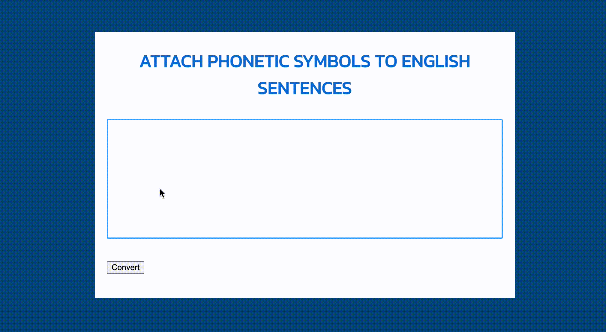

# English to IPA

This program converts English text into the International Phonetic Alphabet (IPA) using the Pronouncing Dictionary published by Carnegie-Mellon University.

This project was ported to JavaScript based on the [mphilli/English-to-IPA](https://github.com/mphilli/English-to-IPA) project.

## Usage

It is available on the GitHub Page at https://t-cool.github.io/English-to-IPA/ .

## License

MIT
